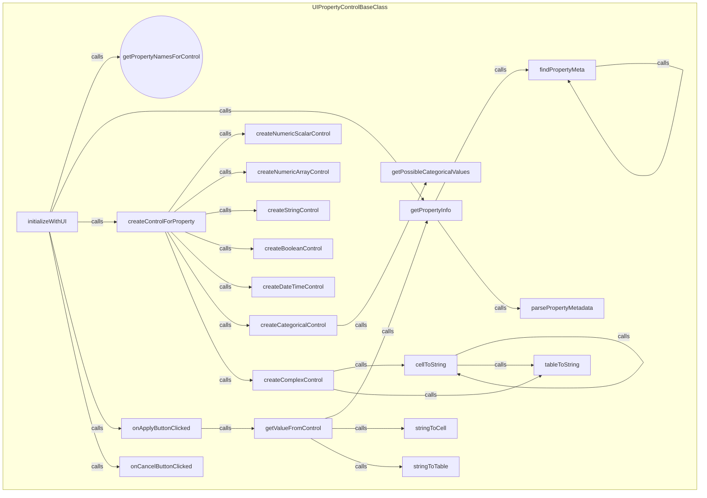

```mermaid
graph TD
    subgraph UIPropertyControlBaseClass
        direction LR
        getPropertyNamesForControl((getPropertyNamesForControl))
        initializeWithUI
        onApplyButtonClicked
        onCancelButtonClicked
        getValueFromControl
        getPropertyInfo
        parsePropertyMetadata
        createControlForProperty
        createNumericScalarControl
        createDateTimeControl
        createStringControl
        createBooleanControl
        createCategoricalControl
        createNumericArrayControl
        createComplexControl
        getPossibleCategoricalValues
        cellToString
        tableToString
        stringToCell
        stringToTable
        findPropertyMeta
    end

    initializeWithUI -- calls --> getPropertyNamesForControl
    initializeWithUI -- calls --> getPropertyInfo
    initializeWithUI -- calls --> createControlForProperty
    initializeWithUI -- calls --> onApplyButtonClicked
    initializeWithUI -- calls --> onCancelButtonClicked

    onApplyButtonClicked -- calls --> getValueFromControl

    getValueFromControl -- calls --> getPropertyInfo
    getValueFromControl -- calls --> stringToCell
    getValueFromControl -- calls --> stringToTable

    getPropertyInfo -- calls --> findPropertyMeta
    getPropertyInfo -- calls --> parsePropertyMetadata

    createControlForProperty -- calls --> createNumericScalarControl
    createControlForProperty -- calls --> createNumericArrayControl
    createControlForProperty -- calls --> createStringControl
    createControlForProperty -- calls --> createBooleanControl
    createControlForProperty -- calls --> createDateTimeControl
    createControlForProperty -- calls --> createCategoricalControl
    createControlForProperty -- calls --> createComplexControl

    createCategoricalControl -- calls --> getPossibleCategoricalValues

    createComplexControl -- calls --> cellToString
    createComplexControl -- calls --> tableToString

    cellToString -- calls --> cellToString
    cellToString -- calls --> tableToString

    findPropertyMeta -- calls --> findPropertyMeta
```
